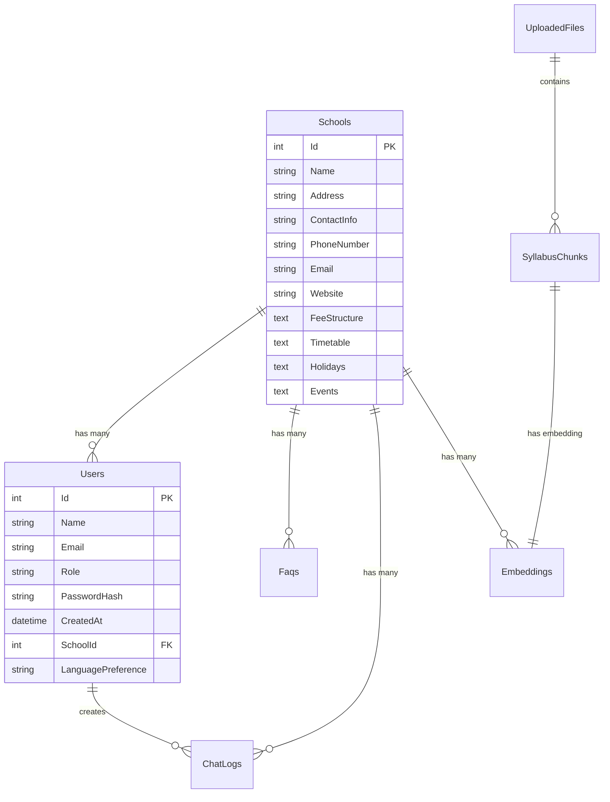

# Database Setup for School AI Chatbot

This guide will help you create all the required database tables and insert sample test data for your School AI Chatbot application.

## Prerequisites

1. **MySQL Client**: You need MySQL client installed on your system
   - Download from: https://dev.mysql.com/downloads/mysql/
   - Or install via package manager:
     ```bash
     # Windows (using Chocolatey)
     choco install mysql

     # macOS (using Homebrew)
     brew install mysql-client

     # Ubuntu/Debian
     sudo apt-get install mysql-client
     ```

2. **Database Server**: Your MySQL server should be running at:
   - **Server**: `school-ai-mysql-server.mysql.database.azure.com`
   - **Database**: `flexibleserverdb`
   - **Username**: `adminuser`
   - **Password**: (The one you set when creating the server)

## Setup Methods

### Method 1: PowerShell Script (Recommended for Windows)

```powershell
# Run from the directory containing database-setup.sql
.\setup-database.ps1 -Password "YOUR_MYSQL_PASSWORD"
```

**Parameters:**
- `-Password`: Your MySQL server password (required)
- `-Server`: MySQL server hostname (optional, defaults to school-ai-mysql-server.mysql.database.azure.com)
- `-Username`: MySQL username (optional, defaults to adminuser)
- `-Database`: Database name (optional, defaults to flexibleserverdb)
- `-SqlFile`: SQL file path (optional, defaults to database-setup.sql)

### Method 2: Batch Script (Windows CMD)

```cmd
setup-database.bat
```

This will prompt you for the password and run the setup automatically.

### Method 3: Manual MySQL Command

```bash
mysql -h school-ai-mysql-server.mysql.database.azure.com -u adminuser -p flexibleserverdb < database-setup.sql
```

Enter your password when prompted.

## What Gets Created

The setup script creates the following tables with sample data:

### 📚 **Schools** (3 schools)
- Springfield Elementary School
- Riverside High School  
- Oakwood Academy

### 👥 **Users** (8 users with different roles)
- **Admins**: John Smith, David Miller
- **Teachers**: Sarah Johnson, Robert Brown, Jennifer Garcia
- **Parents**: Mike Davis, Lisa Anderson
- **Students**: Emma Wilson

### ❓ **FAQs** (10 common questions)
- School hours, contact info, dress codes, lunch schedules, etc.
- Organized by categories: General, Communication, Policies, etc.

### 📁 **Uploaded Files** (4 curriculum files)
- Math curriculum (Grade 5)
- Science syllabus (Grade 8)
- English literature (Grade 10)
- History textbook (Grade 7)

### 📖 **Syllabus Chunks** (6 curriculum sections)
- Math: Number operations, fractions
- Science: Solar system, chemistry basics
- English: Literary analysis
- History: American Revolution

### 🤖 **AI Embeddings** (6 vector embeddings)
- Connected to syllabus chunks for AI-powered search

### 💬 **Chat Logs** (5 sample conversations)
- Real conversations between users and the AI chatbot

## Database Schema



## Verification

After running the setup, you should see:
- ✅ 3 Schools created
- ✅ 8 Users created (2 Admin, 3 Teachers, 2 Parents, 1 Student)
- ✅ 4 UploadedFiles created
- ✅ 6 SyllabusChunks created
- ✅ 10 Faqs created
- ✅ 6 Embeddings created
- ✅ 5 ChatLogs created

## Next Steps

1. **Add MySQL Password to GitHub Secrets**:
   - Go to your GitHub repository
   - Navigate to Settings → Secrets and variables → Actions
   - Add a new secret named `MYSQL_PASSWORD` with your database password

2. **Push Updated Deployment Workflow**:
   ```bash
   git add .github/workflows/deploy-api.yml
   git commit -m "Update API deployment to use MySQL database"
   git push origin main
   ```

3. **Deploy Your API**:
   - The GitHub Actions workflow will automatically deploy your API
   - Your API will now connect to the MySQL database instead of using in-memory storage

## Test Data Overview

### Sample Schools:
- **Springfield Elementary** (K-5): Traditional elementary school
- **Riverside High School** (9-12): Comprehensive high school  
- **Oakwood Academy** (K-12): Private academy

### Sample Users by School:
- **Springfield Elementary**: Admin (John), Teacher (Sarah), Parent (Mike), Student (Emma)
- **Riverside High**: Teacher (Robert), Parent (Lisa - Spanish speaker)
- **Oakwood Academy**: Admin (David), Teacher (Jennifer - Spanish speaker)

### Sample Conversations:
- Student asking about school start time
- Parent checking grades
- Student asking about lunch menu
- Parent asking about conferences
- Teacher asking about graduation requirements

## Troubleshooting

### Connection Issues:
- Verify your password is correct
- Check if your IP is whitelisted in Azure MySQL firewall rules
- Ensure Azure services access is enabled

### Permission Issues:
- Make sure the `adminuser` has proper permissions
- Verify the database `flexibleserverdb` exists

### Script Issues:
- Ensure you're running from the directory containing `database-setup.sql`
- Check that MySQL client is properly installed and in your PATH

## Support

If you encounter any issues:
1. Check the error messages carefully
2. Verify your connection details
3. Ensure your MySQL server is running and accessible
4. Review the Azure MySQL server firewall settings

Your School AI Chatbot database is now ready with comprehensive test data! 🎉